# Tessera — Product Overview

> An AI fraud analyst that investigates ambiguous transactions, calls live data tools, and returns a grounded, cited verdict — or escalates to a human reviewer. Never a guess.

---

## TL;DR

| Question | Answer |
|---|---|
| **What does it do?** | Replaces the human analyst step for the ~5–10% of transactions that rule engines cannot resolve. |
| **Who is it for?** | Fraud ops teams at modern fintech (Stripe, Brex, Ramp, Mercury) drowning in escalation queues. |
| **How does it decide?** | Claude Sonnet 4.6 in a tool-use loop over 6 live data APIs, with an application-layer grounding override that forces ESCALATE when no source is cited. |
| **What does it return?** | A typed `Verdict` — `APPROVE | DECLINE | ESCALATE` — with `cited_sources`, `signals`, `cost_usd`, `latency_ms`, and a Langfuse trace. |
| **SLO** | < 5s per verdict · < $0.10 per decision · ≥ 80% match with human analyst on the golden set. |

---

## 1. The Problem (and why an LLM is the right hammer)

Modern fraud systems do well on the obvious cases. A rule engine catches "card BIN on the blacklist" or "amount > $10k for a new account" instantly. What rule engines can't handle is the **ambiguous middle 5–10%** — the cases where:

- Signals conflict (clean user history + VPN IP)
- Context is required (the merchant category matches the user's prior purchases, but the device is new)
- The pattern is novel (a card-testing attack from an IP that was clean an hour ago)

Today those cases land in an analyst queue. A human reads 3–4 dashboards, looks up case precedent, makes a call. Median time-to-decision: **30+ minutes**. Cost: an analyst at $100k/year reviewing 80–100 cases/day.

Tessera does the same investigation in seconds — but only commits to a decision when it can cite the source. Otherwise it escalates with a categorized reason.

---

## 2. System Architecture (C4 — Context)

The 30-second view: what talks to what at the boundary.

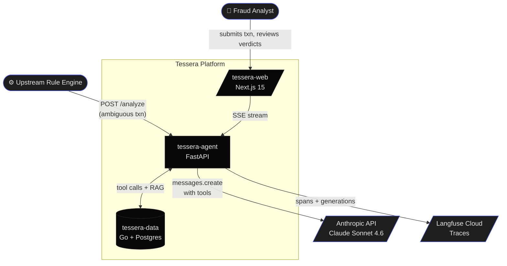

---

## 3. Container View (C4 — Level 2)

The components inside each service.

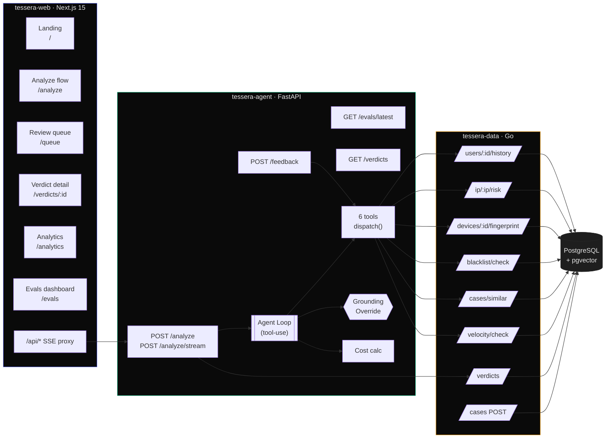

---

## 4. Request Lifecycle — Analyze Sequence

What happens between "click Run Analysis" and seeing a verdict.

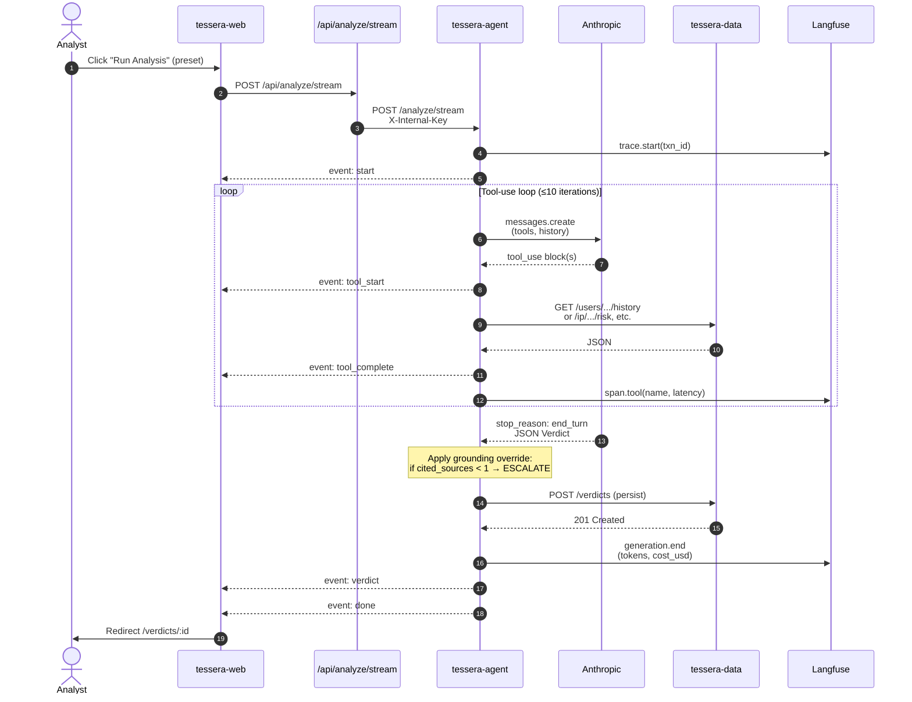

**Latency budget** (target): tools 1.5s · LLM loop 2.5s · grounding override + persist 0.3s · overhead 0.7s = **< 5s** total.

---

## 5. The Agent Loop (flowchart)

The decision logic inside `tessera-agent/app/services/analyze.py`.

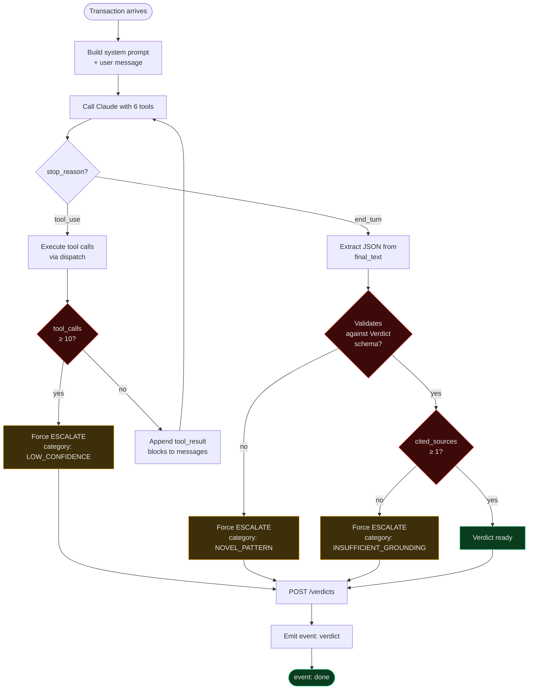

The three forced-escalation paths are the architectural insight: **Tessera never silently fails**. Every uncited verdict, every parse failure, every runaway loop becomes an ESCALATE with a typed category.

---

## 6. Verdict State Machine (frontend perspective)

What the browser tracks during a single analyze flow.

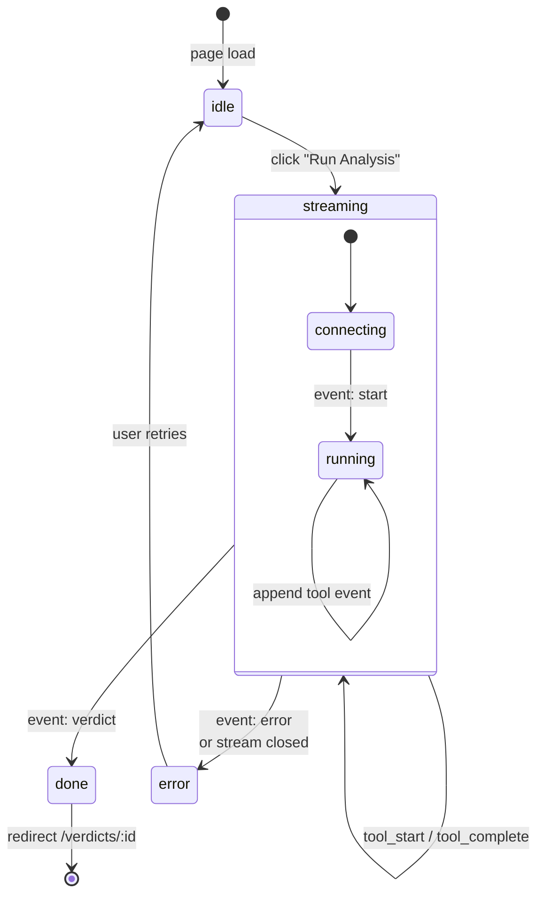

---

## 7. Data Model (ER diagram)

The Postgres schema — what is persisted between requests.

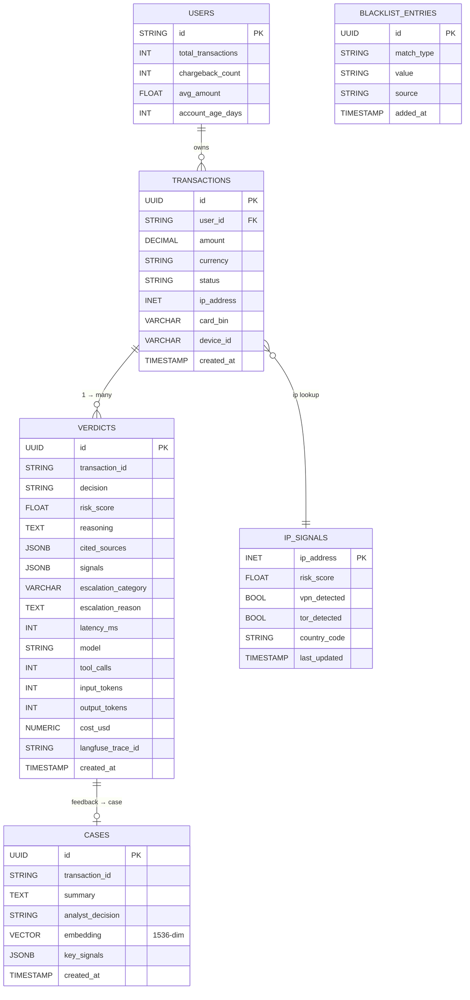

---

## 8. The RAG Flywheel (data flow)

The most subtle part of the product — how analyst feedback becomes future agent context.

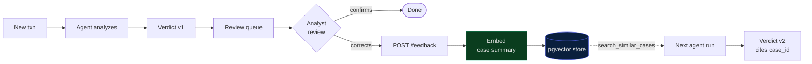

Every correction feeds the corpus. Within a few weeks, the agent has retrieved precedent for most of its decisions — and the grounding override means it cites them rather than guessing.

---

## 9. Tool Catalog

The 6 tools the agent has at its disposal. Order matters — the descriptions in `tessera-agent/app/tools/__init__.py` give Claude sequencing hints.

| # | Tool | Endpoint | Returns | When to call |
|---|---|---|---|---|
| 1 | `get_user_history` | `GET /users/:id/history` | total_txns, chargeback_count, account_age_days | First, every analysis — establishes baseline |
| 2 | `get_ip_risk` | `GET /ip/:ip/risk` | risk_score, vpn/tor flags, ISP | Early — drives later escalation choices |
| 3 | `get_device_fingerprint` | `GET /devices/:id/fingerprint` | seen_before, fraud_flag | After user history — detects user/device mismatch |
| 4 | `check_blacklist` | `GET /blacklist/check` | matched (bool), match_type, source | Every transaction — fast DECLINE path |
| 5 | `search_similar_cases` | `POST /cases/similar` | top-5 cases with similarity_score | When signals conflict — grounded precedent |
| 6 | `check_velocity` | `GET /velocity/check` | distinct_users_by_ip, by_bin, total_in_window | When IP risk is elevated — card-testing detector |

**Tool cap**: 10 calls per analysis. Reaching the cap forces an ESCALATE with category `LOW_CONFIDENCE` — the agent gave up rather than guessing.

---

## 10. Verdict Anatomy

Every analysis produces this exact shape. The grounding contract is enforced at the application layer (Pydantic + a post-validation check), not just in the prompt.

```jsonc
{
  "transaction_id": "txn_demo_fraud_001",
  "decision": "DECLINE",                          // APPROVE | DECLINE | ESCALATE
  "risk_score": 0.92,
  "reasoning": "Card BIN 424242 matches blacklist...",
  "cited_sources": [                              // ← grounding contract
    { "type": "blacklist", "id": "bl_424242", "added_at": "2026-05-01T..." },
    { "type": "case",      "id": "case_a1b2", "similarity": 0.91 }
  ],
  "signals": [
    { "name": "blacklist_match",  "severity": "high",   "value": "424242" },
    { "name": "velocity_flag",    "severity": "high",   "value": "8 users/BIN in 60min" },
    { "name": "ip_risk",          "severity": "medium", "value": 0.78 }
  ],
  "escalation_category": null,                    // typed enum (5 values) or null
  "escalation_reason":   null,                    // human-readable detail
  "latency_ms": 4312,
  "model": "claude-sonnet-4-6",
  "tool_calls": 5,
  "input_tokens": 12847,                          // ← unit economics
  "output_tokens": 312,
  "cost_usd": 0.04323,
  "langfuse_trace_id": "lf_8f3a1c..."            // ← full reasoning trace
}
```

**The grounding contract:** if `cited_sources.length < 1` AND `decision != "ESCALATE"`, the application layer rewrites the verdict to `ESCALATE` with `escalation_category = "INSUFFICIENT_GROUNDING"`. This happens in code, not in the prompt — Claude cannot bypass it.

---

## 11. Observability & Unit Economics

### Cost per decision

Tessera tracks every Anthropic call's `input_tokens` and `output_tokens` across the full tool-use loop and computes `cost_usd` per verdict at pricing constants for Claude Sonnet 4.6 (`$3.00/M in`, `$15.00/M out`). The analytics page surfaces:

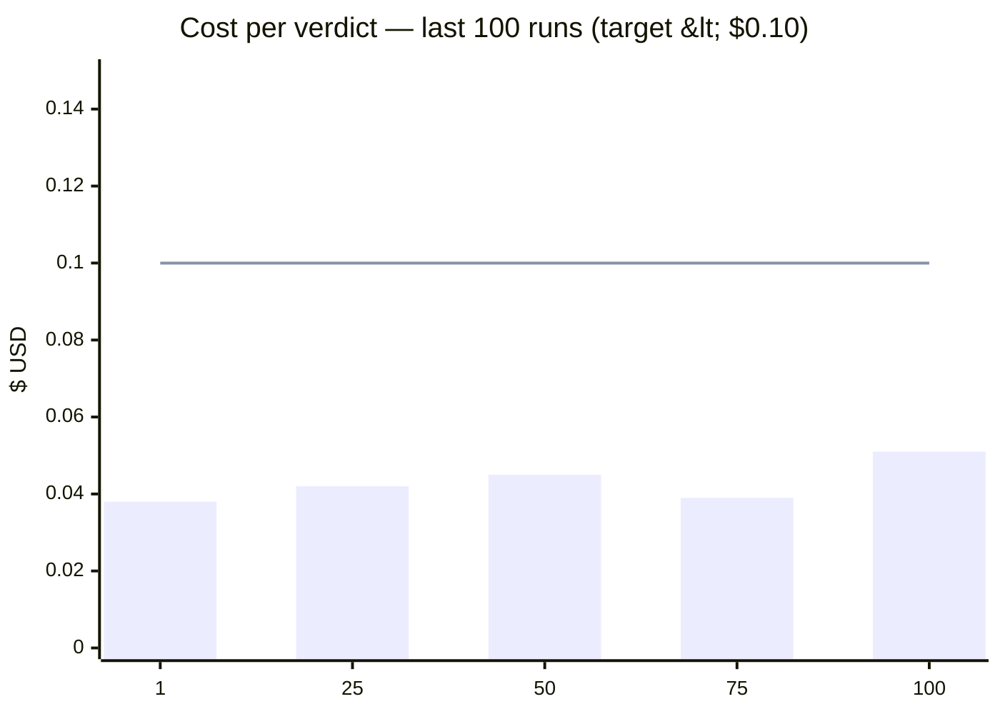

### Latency budget

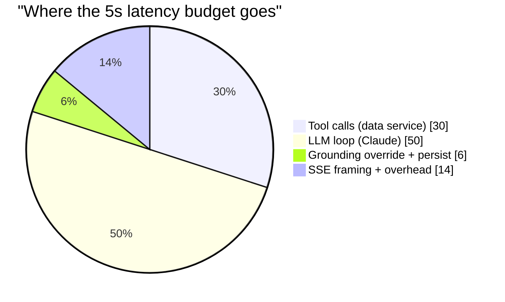

### Langfuse spans

Every verdict has one parent trace with child spans for each tool call and each `messages.create`. Engineers reproduce any production decision by opening the trace.

---

## 12. Evaluation Methodology

### The golden set

50–100 cases, each labeled `expected_decision` by a human analyst. Stored in `tessera-agent/evals/golden_dataset.json`. The CLI runs the eval against the live agent service (not a mock) and writes results to `evals/results/latest.json`.

```bash
cd tessera-agent && uv run python -m evals --repeats 3
```

### What gets measured

| Metric | Definition | Surfaced on |
|---|---|---|
| **match_rate** | fraction of cases where actual == expected | `/evals` headline |
| **precision (DECLINE)** | of N declines, how many were truly fraud | `/analytics` Calibration |
| **recall (DECLINE)** | of N true frauds, how many we declined | `/analytics` Calibration |
| **pass^k** | fraction of cases where ALL k runs were correct | `/evals` Reliability card |
| **avg / p95 latency** | end-to-end ms | `/evals` overview |
| **errors** | runs that raised | `/evals` overview |
| **confusion matrix** | 3×3 expected vs actual | `/evals` heatmap |

### Why pass^k matters

A single match_rate of 96% sounds great — until you realize that for a typical case, your agent has a 4% chance of being wrong on any given run. Pass^3 forces all 3 independent runs to be correct, which is the metric that maps to production reliability. **Always compare pass^k, not match_rate.**

---

## 13. Tech Stack

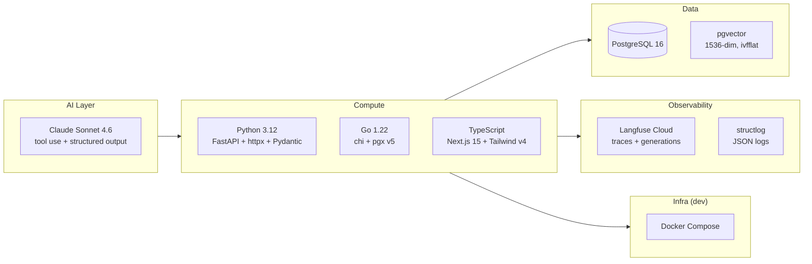

---

## 14. Service Surface Area

The contract every service exposes.

### `tessera-agent` (port 8001)

| Method | Path | Purpose |
|---|---|---|
| POST | `/analyze` | One-shot verdict (blocking) |
| POST | `/analyze/stream` | SSE stream of `tool_start` / `tool_complete` / `verdict` |
| POST | `/feedback` | Index an analyst correction into the RAG corpus |
| GET | `/verdicts` | List recent verdicts (proxies to data) |
| GET | `/evals/latest` | Latest eval run JSON |
| GET | `/healthz` | Liveness |

### `tessera-data` (port 8002)

| Method | Path | Purpose |
|---|---|---|
| GET | `/users/:id/history` | Tool 1 backend |
| GET | `/ip/:ip/risk` | Tool 2 backend |
| GET | `/devices/:id/fingerprint` | Tool 3 backend |
| GET | `/blacklist/check` | Tool 4 backend |
| POST | `/cases/similar` | Tool 5 backend (pgvector) |
| GET | `/velocity/check` | Tool 6 backend |
| POST | `/cases` | Feedback ingest (embed + insert) |
| POST | `/verdicts` | Persist verdict + upsert txn velocity fields |
| GET | `/verdicts` | List for queue / analytics |
| GET | `/verdicts/:transaction_id` | Verdict detail |

All authenticated via `X-Internal-Key`. All errors follow the `{"error":{"code","message","details"}}` envelope.

### `tessera-web` (port 3000)

| Route | Purpose |
|---|---|
| `/` | Landing page |
| `/analyze` | Submit a transaction; live SSE panel |
| `/queue` | Recent verdicts |
| `/verdicts/:id` | Verdict detail + feedback form |
| `/analytics` | Decision distribution, calibration, escalation breakdown |
| `/evals` | Live eval results |

Same-origin API routes under `/api/*` proxy SSE and JSON to the agent, keeping the internal key off the browser.

---

## 15. The Trust Contract (why a CTO should believe this)

Three architectural choices distinguish Tessera from "Claude + prompt + ship":

1. **Grounding is enforced in code, not in the prompt.** The Pydantic schema validates structure; a post-validation hook validates citation. Uncited verdicts cannot escape — they are rewritten to `ESCALATE` deterministically.

2. **ESCALATE is a first-class output, not an error.** The agent has explicit permission to say "I don't know" via 5 typed categories (`CONFLICTING_SIGNALS`, `INSUFFICIENT_GROUNDING`, `LOW_CONFIDENCE`, `NOVEL_PATTERN`, `POLICY_REQUIRED`). Analytics surfaces the breakdown so the ops team can tune the system.

3. **Unit economics are tracked, not assumed.** Token usage is accumulated across the tool-use loop and persisted per verdict. The analytics page colors the average cost red if it crosses $0.10. The team knows immediately if a prompt change pushed the SLO.

---

## 16. Roadmap

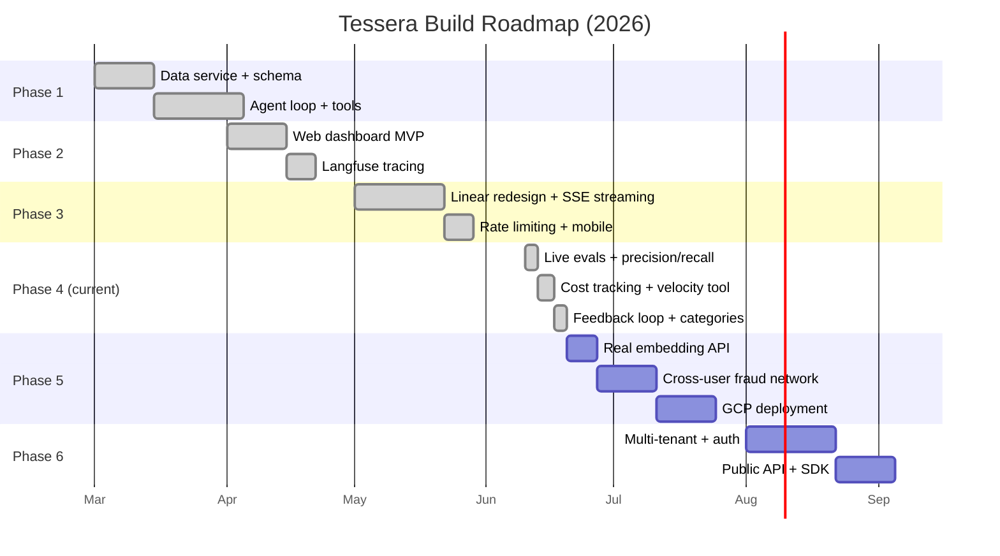

---

## 17. Quick Start (local dev)

```bash
# Infra
docker compose up -d                               # Postgres + pgvector

# Data service
cd tessera-data && go run ./cmd/server &           # :8002

# Agent service
cd tessera-agent && uv run fastapi dev --port 8001 &

# Web
cd tessera-web && npm run dev                      # :3000

# Run an eval
cd tessera-agent && uv run python -m evals --repeats 3

# Open the dashboard
open http://localhost:3000
```

Mock mode runs end-to-end without an `ANTHROPIC_API_KEY` — synthetic tool delays, deterministic verdicts, full SSE stream. Useful for demos and CI.

---

## 18. Where to look next

| You want… | Read |
|---|---|
| The original product spec | [`prd.md`](./prd.md) |
| The verdict JSON contract | [`verdict-schema.md`](./verdict-schema.md) |
| Why microservices over monolith | [`decisions/ADR-001-microservices-over-monolith.md`](./decisions/ADR-001-microservices-over-monolith.md) |
| Why this language for this service | [`decisions/ADR-002-language-selection.md`](./decisions/ADR-002-language-selection.md) |
| Why grounding lives in code, not the prompt | [`decisions/ADR-003-grounding-enforcement.md`](./decisions/ADR-003-grounding-enforcement.md) |
| Why RAG over fine-tuning | [`decisions/ADR-004-rag-over-fine-tuning.md`](./decisions/ADR-004-rag-over-fine-tuning.md) |
| Auth, error format, timeouts between services | [`conventions/inter-service-communication.md`](./conventions/inter-service-communication.md) |
| The Langfuse contract and logging shape | [`conventions/observability.md`](./conventions/observability.md) |
| Code structure per service | [`conventions/code-conventions.md`](./conventions/code-conventions.md) |
| Service-specific context for an agent/IDE | [`agent_docs/`](./agent_docs/) |
